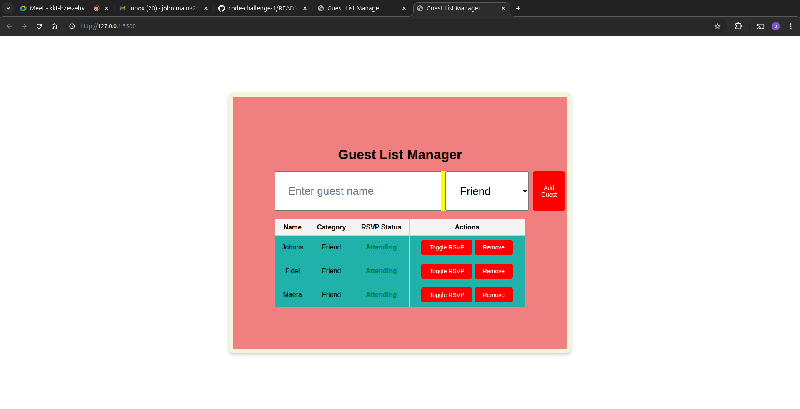

# Guest List Manager

A simple web application to manage your event guest list. Add guests, categorize them (Friend, Family, Colleague), track RSVP status, and manage your list with an intuitive interface.

## Features

- Add guests with name and category
- View guests in a styled table
- Track RSVP status (Attending/Not Attending)
- Edit or remove guests from the list
- Responsive and colorful UI

## Usage

1. Clone or download this repository.
2. Open `index.html` in your web browser.
3. Enter guest details and manage your list easily.

## Files

- `index.html` — Main HTML file
- `style.css` — Custom styles for the app
- `index.js` — JavaScript logic for interactivity

## Screenshot

 <!-- Add a screenshot if available -->

## Author
JOHN MAINA(devjohnns)

## License

MIT License